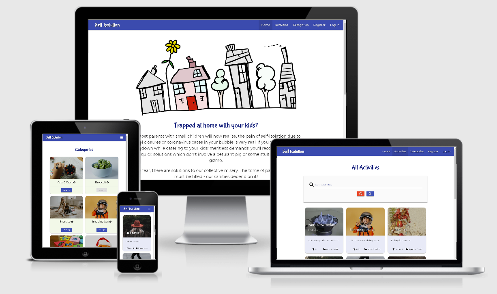

# Self Isolution



**[Live demo](https://self-isolution.herokuapp.com/)**

---

<span id="top"></span>

## Index

- <a href="#context">Context</a>
- <a href="#ux">UX</a>
  - <a href="#ux-overview">Overview</a>
  - <a href="#ux-stories">User stories</a>
  - <a href="#ux-wireframes">Wireframes</a>
  - <a href="#ux-design">Design</a>
- <a href="#database-model">Database model</a>
- <a href="#features">Features</a>
  - <a href="#features-current">Current</a>
  - <a href="#features-future">Future</a>
- <a href="#technologies">Technologies Used</a>
- <a href="#testing">Testing</a>
- <a href="#deployment">Deployment</a>
- <a href="#credits">Credits</a>

---

<span id="context"></span>

## Context

The COVID-19 pandemic has had a dramatic effect on everyone's lives, not least those of working parents who can no longer rely on childcare due to the restrictions put in place.
When a case occurs in your child's bubble and they are forced to self-isolate at home, you can expect to spend your days fitting work in around your children's homeschooling
and other needs. Without the option of leaving the house you'll be climbing the walls in no time, feeling guilty that you've left them to watch Peppa Pig for 4 hours straight, again.
You need to break the cycle and find some inspiration without having to create elaborate plans which will likely be greeted with a slow clap and roll of the eyes, leaving you
ever more frustrated with them, yourself and the situation at large. You need a Self Isolution.

<div align="right"><a style="text-align:right" href="#top">Go to index :arrow_double_up:</a></div>
<span id="ux"></span>

## UX

<span id="ux-overview"></span>

### Overview

Self Isolution is a site aimed at parents of young children who have been put into self-isolation. Users are looking for ideas for simple activities to entertain, educate and somehow enrich the lives of their offspring, without leaving the comfort of their own homes. All content is available without registering, but once logged in users can add their
own activity ideas and share the collective burden of raising this misfortunate generation. All design decisions have been made with the following goals in mind:
- Accessibility
- Ease of use
- Responsiveness
- Simplicity

<span id="ux-stories"></span>

### User stories

#### Overarching user expectations

- Consistent
- Easy to navigate
- Intuitive
- Responsive
- Secure
- Visually appealing

#### As a first-time visitor I want

- To immediately understand what the purpose of the site is and what it can provide
- To see all content without having to register
- To be able to search for keywords
- To be able to filter activities by category
- To be able to register easily without needing to input lots of information

#### As a returning user I want

- To log in and out easily
- To be able to add new activities easily
- To be able to edit or delete activities I have added
- To upload my own images rather than inputting a URL
- To be able to see all the activities I have added in one place
- To be able to 'favourite' activities created by other users

#### As the site owner I want:

- To be able to edit or remove content created by users
- To be able to add, edit or remove categories

<span id="ux-wireframes"></span>

### Wireframes

Wireframes created at the start of the project for **mobile**, **tablet** and **desktop** can be accessed [here](wireframes/), as well as the planned **site map** and **data schema**.

There were some noteworthy deviations from the plan. These were:

1. Search bar given greater prominance within Activities page rather than being housed in navbar
2. Prep time not included as a MongoDB key
3. Ages hardcoded instead of residing in separate MongoDB collection and having its own 'section'
4. Likes not included, meaning 'Popular activities' was replaced by 'Recent activities' on the home page
5. Categories dropdown moved to separate Categories page
6. Ages dropdown removed, but users can still filter by age by clicking on existing activity's target age
7. Users' collection keys simplified to just username and password
8. Activities card content revised based on testing
9. View Activity page layout revised due to awkward styling presentation, but functionality mostly unchanged

<span id="ux-design"></span>

### Design choices

The decision to use Materialize meant customisation was somewhat limited, but this was an acceptible compromise given the site's purpose of displaying user content clearly. Judicious use of the framework's cards gives the site a solid and consistent feel which promotes the user content. 

#### Colours

[Coolers](https://coolors.co/) was used to find an appropriate colour scheme for the site, however the decision was made to default to Materialize's stock colours wherever possible, and to simply use the hex values of the framework's named colours in any required custom CSS styling.

**Core**

Two bold shades of Materialize's indigo were used for the core elements of the site, namely the Navbar, Footer and section headings. The aim was to have a neutral colour, not overly warm, to maintain a contrast with the white text and background.

-  #3949ab (indigo darken-1)
-  #1a237e (indigo darken-4)

**Cards**

To give the activity and category cards some weight, lighter shades of indigo and green were used. The aim was to distinguish the two types of cards so that users can tell at a glance which page they are on and what the cards are representing. 

-  #e8eaf6 (indigo lighten-5)

-  #e8eaf6 (light-green lighten-5)

**Buttons**

It was important for the buttons to have have consistent colours with intuitive suggestions about their functions. A slightly lighter shade of indigo was used for buttons which could be classed as part of the outer 'shell' of the site, responsible for navigating the site and matching the Navbar and Footer's colour. These are  Search, 'Back to Activities', active pagination page, 'View' (category's activities) and 'Cancel' (a deletion). One exception was made for the hover effect of activity filters (i.e. target age, category and activity author), to provide some variety.

A 'green means go' approach was taken for button buttons which suggest the user making changes to their content (i.e. Edit and 'Submit'). Negative user actions are all red: Delete, confirm delete and 'Cancel' search.

Orange was used as an accent colour for the pulsing FAB 'Add Activity' and 'Add Category' and also for Toast alert messages.

-  #26a69a (teal lighten-1)

-  #3f51b5 (indigo)

-  #f44336 (red)

-  #f44336 (orange accent-4)

**Other**

To provide a touch of variety, the chips containing required equipment on the View Activity page have a lighter shade of blue.

-  #0077ff ("Dodger Blue")


#### Fonts

[Bubblegum Sans](https://fonts.google.com/specimen/Bubblegum+Sans#about)

TBC

[Montserrat](https://fonts.google.com/specimen/Montserrat#about)

TBC

<div align="right"><a style="text-align:right" href="#top">Go to index :arrow_double_up:</a></div>


<span id="database-model"></span>

### Database model

MongoDB's non-relational/document-based database structure makes sense for this type of site as there are only a few relationships between the various collections. Nevertheless, the ability to relate certain collections to one another was used to preserve key relationships which could have been lost due to users making changes to their content.

#### Activities collection

|**Key**|**Type**|**Notes**|
|:-----|:-----|:-----|
|_id|ObjectId||
|activity_name|string|The user's chosen title of the activity.|
|category_name|string|To avoid potential muddling of activity categories the decision was made to prevent category names being changed by the admin, which meant using a string rather than ObjectID was preferable.|
|target_age|string|Options such as 'Under 2' and '6+' meant using int was not appropriate here.|
|activity_summary|string|Brief summary used to flesh out cards on Activities page.|
|activity_details|string|The main content of the View Activity page.|
|image_file|string|This is a link to a user image uploaded to Amazon AWS. If left blank the relevant category.image_file will be used, but this field will be left unaltered.|
|created_by|string|Set on activity creation. As users cannot change username, simpler to store as a string.|
|date_added|string|Set on activity creation. Activities are sorted by _id therefore simplest to store as a string.|
|activity_equipment|string|Rather than storing as an array, it was simpler to request users enter each item on new line and manipulate in Python.|

#### Categories collection

|**Key**|**Type**|**Notes**|
|:-----|:-----|:-----|
|_id|ObjectId||
|category_name|string|The admin's chosen title of the category. Cannot be changed.|
|category_summary|string|Brief summary to add some meat to the Categories cards.|
|image_file|string|This is a link to an image uploaded to Amazon AWS by the admin.|
|activity_list|Array|Given the possibility of users changing the name of their activity, the decision was made to store activity ObjectIDs in array.|


#### Users collection

|**Key**|**Type**|**Notes**|
|:-----|:-----|:-----|
|_id|ObjectId||
|username|string|Chosen by user on account creation. Cannot be changed.|
|password|string|Chosen by user on account creation and hashed using Werkzeug Security.|

#### Ages collection

Initially it was anticipated that the admin might need the ability to change the target age ranges, but as the site progressed this no longer seemed necessary and this collection was abandoned and replaced by a hardcoded selection.

<div align="right"><a style="text-align:right" href="#top">Go to index :arrow_double_up:</a></div>

<span id="features"></span>

## Features

<span id="features-current"></span>

### Current

**?. Material design**

MaterializeCSS features:
- [Cards](https://materializecss.com/cards.html)
- [Forms](https://materializecss.com/text-inputs.html)
- [Menu dropdown](https://materializecss.com/dropdown.html)
- [Modals](https://materializecss.com/modals.html)
- [Sidenav](https://materializecss.com/sidenav.html)
- [Toasts](https://materializecss.com/toasts.html)

**?. Secure passwords**

When registering for the site, the user's password is hashed so that it is not revealed to the database owner.

**?. CRUD functionality**

Visitors can:
- View all activities
- View all categories

Users can:
- Add their own activities
- Edit their own activities 
- Delete their own activities

The admin can:
- Add their own activities
- Edit any users' activities
- Delete any users' activities
- Add a category
- Edit a category
- Delete a category

**?. Image uploads**

Rather than having to find a URL for an image, users can upload their own files. This encourages them to provide their own content, but if they skip this step then a default image is displayed from the relevant category.

**?. Image resizing**

Prior to uploading an image, a user's file is resized so that it does not adversely affect site load times, and also gives some control over its dimensions.

**?. User profile**

Users can view all activities they have created in one place and easily edit or delete them.

**?. Admin rights**

The admin has the additional ability to:
- Edit or delete any activity on the site from its View Activity page, including changing an activity's category to 'Unassigned'
- Add categories
- Edit a category summary or image, but they cannot edit the name of a category to preserve relationship integrity
- Delete categories from the Categories page, reassigning activities to the 'Unassigned' category

**?. Confirm delete**

When the user or admin clicks to delete an activity or category, a modal pops up to confirm they wish to do so to prevent accidental deletion.

**?. Category reassignment on deletion**

When the admin chooses to delete a category which has associated activities, these activities are moved to the 'Unassigined' category and are still visible on the site. 

**?. Search**

All users can search for keywords appearing in:
- Activity title
- Activity summary
- Activity description
- Activity required equipment

Activities can be filtered by category from the Categories page and also by target age or activity author by clicking on the associated tag from the Activities, View Activity or Profile pages.

**?. Pagination**

The Activities page (and any search or filters applied) will limit the number of activities visible to 9 in order to reduce the number of images loaded and keep the focus on the content. As individual users are unlikely to be adding much more than 9 activities, it makes sense not to paginate the Profile page to avoid spilling onto a second page in this rare instance.

**?. Access protection**

Routes to restricted functions such as add, edit and delete (for both session user and admin) are protected so that they cannot be accessed by brute force via the URL.

**?. 404 and 500 error handling**

Pages for 404 and 500 errors keep the user on the site when something goes wrong, allowing them to return to the content with minimal disruption.


<span id="features-future"></span>

### Future

**TBC**

- Edit user
- Delete user
- Favourite activities
- Superuser rather than single admin
- Admin area (page to view all site content in one place and edit as required inc delete user)
- Contact admin
- Pagination
- Deeper profile (number of kids, interests)
- Ability to view other profiles
- Add comments to activities
- Image delete from S3 Bucket
- Speedier hosting of S3 Bucket images

<div align="right"><a style="text-align:right" href="#top">Go to index :arrow_double_up:</a></div>

<span id="technologies"></span>

## Technologies Used

### Languages

- HTML
- CSS
- Javascript
  - [jQuery](https://jquery.com/)
- Python
  - [Flask Paginate](https://pythonhosted.org/Flask-paginate/)

### Project management

- [Balsamiq](https://balsamiq.com/wireframes/) - Wireframe creation tool
- [GitHub](https://github.com/) - Version control and deployment
- [GitPod](https://gitpod.io/) - IDE used to code the game

### Style and theme

- [Autoprefixer](https://autoprefixer.github.io/) - a PostCSS plugin which parses CSS and adds vendor prefixes
- [Favicon.io](https://favicon.io//) - to generate the app's favicons for a variety of devices
- [Google Fonts](https://fonts.google.com/) - TBC
- [Materialize](https://materializecss.com/) - TBC

### Online resources

- [Am I Responsive?](http://ami.responsivedesign.is/) - to produce the README showcase image

<div align="right"><a style="text-align:right" href="#top">Go to index :arrow_double_up:</a></div>

<span id="deployment"></span>

## Deployment

The master branch of this repository is the most current version and has been used for the deployed version of the site.

### Prerequisites

[Python 3](https://www.python.org/downloads/) - core code

[PIP](https://pypi.org/project/pip/) - package installation

[Git](https://git-scm.com/) - version control

[MongoDB](https://www.mongodb.com/)

- MongoDB is the database used by the app to store content uploaded by its users.
- The following collections should be created:
  - activities
  - categories
  - users
- A document in categories should be created with the following fields:

|**Key**|**Value**|**Type**|
|:-----|:-----|:-----|
|category_name|Unassigned|String|
|category_summary||String|
|image_file||String|
|activity_list||Array|

[Amazon AWS S3 Bucket](https://aws.amazon.com/)

- An Amazon S3 Bucket is used to host the images uploaded to the app by its users.

***Values for the env.py environment variables and Heroku Cvars used in the sections below will be unique to each MongoDB and S3 Bucket created. Please refer to their respective documentation for further details.***


### How to clone Self Isolution

To clone this project from its [GitHub repository](https://github.com/Edb83/self-isolution):

1. From the repository, click **Code**
2. In the **Clone >> HTTPS** section, copy the clone URL for the repository
3. In your local IDE open Git Bash
4. Change the current working directory to the location where you want the cloned directory to be made
5. Type `git clone`, and then paste the URL you copied in Step 2

```console
git clone https://github.com/Edb83/self-isolution.git
```

6. Press Enter. Your local clone will be created
7. Create a file called env.py to hold your app's environment variables, which should contain the following:

```console
import os

os.environ.setdefault("IP", "0.0.0.0")
os.environ.setdefault("PORT", "5000")
os.environ.setdefault("SECRET_KEY", "<app secret key>")
os.environ.setdefault("MONGO_URI", "mongodb+srv://<username>:<password>@<cluster_name>-ofgqg.mongodb.net/<database_name>?retryWrites=true&w=majority")
os.environ.setdefault("MONGO_DBNAME", "<database name>")

os.environ.setdefault("S3_BUCKET", "<S3 bucket name>")
os.environ.setdefault("S3_KEY", "<S3 key>")
os.environ.setdefault("S3_SECRET_ACCESS_KEY", "<S3 secret key>")
os.environ.setdefault("S3_LOCATION", "https://<S3 bucket name>.s3.<S3 bucket region>.amazonaws.com/")
```
8. **Make sure that env.py is listed in your .gitignore file to prevent your environment variables being pushed publicly**


### How to deploy to Heroku

To deploy the app to Heroku from its [GitHub repository](https://github.com/Edb83/self-isolution), the following steps were taken:

1. From the GitPod terminal, create **requirements.txt** and **Procfile** using these commands:

```console
pip3 freeze --local > requirements.txt
echo web: python app.py > Procfile
```

2. **Push** these files to GitHub
3. **Log In** to [Heroku](https://id.heroku.com/login)
4. Select **Create new app** from the dropdown in the Heroku dashboard
5. Choose a unique name ('self-isolution') for the app and the location nearest to you
6. Go to the **Deploy** tab and under **Deployment method** choose GitHub
7. In **Connect to GitHub** enter your GitHub repository details and once found, click **Connect**
8. Go to the **Settings** tab and under **Config Vars** choose **Reveal Config Vars**
9. Enter the following keys and values, which must match those in the env.py file created earlier:

|**Key**|**Value**|
|:-----|:-----|
|IP|`0.0.0.0`|
|PORT|`5000`|
|SECRET_KEY|`<app secret key>`|
|MONGO_URI|`mongodb+srv://<username>:<password>@<cluster_name>-ofgqg.mongodb.net/<database_name>?retryWrites=true&w=majority`|
|MONGO_DBNAME|`<database name>`|
|S3_BUCKET|`<S3 bucket name>`|
|S3_KEY|`<S3 key>`|
|S3_SECRET_ACCESS_KEY|`<S3 secret key>`|
|S3_LOCATION|`https://<S3 bucket name>.s3.<S3 bucket region>.amazonaws.com/`|

10. Go back to the **Deploy** tab and under **Automatic deploys** choose **Enable Automatic Deploys**
11. Under **Manual deploy**, select **master** and click **Deploy Branch**
12. Once the app has finished building, click **Open app** from the header row of the dashboard

<div align="right"><a style="text-align:right" href="#top">Go to index :arrow_double_up:</a></div>

<span id="testing"></span>

## Testing

Full details of testing can be found [here](TESTING.md).

<div align="right"><a style="text-align:right" href="#top">Go to index :arrow_double_up:</a></div>

<span id="credits"></span>

## Credits

#### Tutorials and inspiration

- Code Institute Task Manager Project
- [Boto S3](https://boto3.amazonaws.com/v1/documentation/api/latest/reference/services/s3.html#id224)
- [Pillow](https://pillow.readthedocs.io/en/stable/index.html)
- [Flask Paginate](https://gist.github.com/mozillazg/69fb40067ae6d80386e10e105e6803c9)


#### Code used/modified from other sources

- [Handling file uploads with Flask](https://blog.miguelgrinberg.com/post/handling-file-uploads-with-flask)
- [Uploading to AWS S3 using boto](https://www.zabana.me/notes/flask-tutorial-upload-files-amazon-s3)
- [Resizing images prior to S3 upload](https://stackoverflow.com/a/56241877)
- [Image processing with Pillow](https://dzone.com/articles/image-processing-in-python-with-pillow)
- [Checking duplicate key value pairs](https://stackoverflow.com/a/3897516)


### Content

- All text outside of user-generated content is original
- [Favicon](https://favicon.io/emoji-favicons/house)
- Images from [Pixabay](https://pixabay.com/)

### Acknowledgements

- Jonathan Munz (Code Institute Mentor) - for his reassurance, support and invaluable suggestions
- Tim (Code Institute Tutor) - for his patience in helping me to solve an issue with updating a MongoDB array
- All of the Code Institute tutors who helped me to solve some of the snagging issues towards the end of the project

### Disclaimer

This site was developed for educational purposes.

<div align="right"><a style="text-align:right" href="#top">Go to index :arrow_double_up:</a></div>